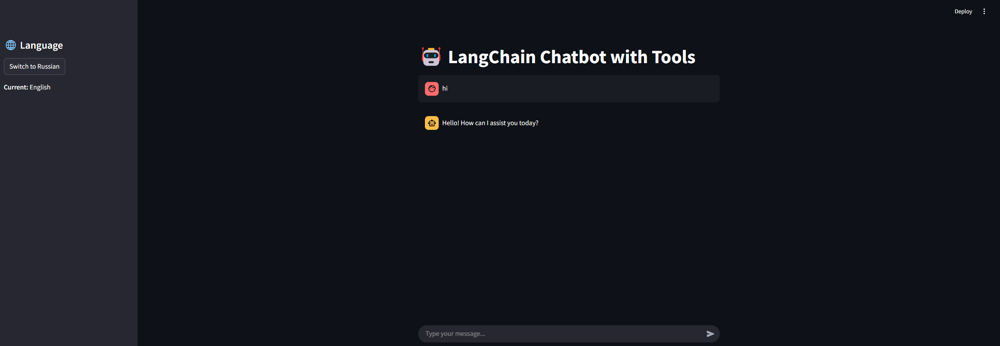

# 🤖 LangChain Chatbot with Tools

A Streamlit-based chatbot app using OpenAI's GPT model and LangChain tools (like a calculator and greeting bot). Built with Docker support for easy deployment.

---

## 📦 Features

- 💬 Chatbot powered by `gpt-3.5-turbo` via LangChain
- 🧰 Custom tools (calculator, say_hello)
- 🌍 Multilingual UI toggle (English / Russian)
- 📦 Dockerized for deployment
- 🔐 `.env` support for API keys

---

## 🚀 Demo

  
> Example chatbot conversation using Streamlit UI with custom tools.

---

## 🛠 Requirements

- Python 3.11
- OpenAI API Key
- Docker (for containerized use)

---

## 📁 Project Structure

```
.
├── main.py               # Streamlit app
├── Dockerfile            # Docker build file
├── requirements.txt      # Python dependencies
├── .env                  # API key (not committed)
├── .dockerignore
└── README.md
```

---

## 🧪 Running Locally

### 1. Clone the repo

```bash
git clone https://github.com/yourusername/chatbot_with_tools.git
cd chatbot_with_tools
```

### 2. Set up environment

Create `.env`:

```
OPENAI_API_KEY=sk-xxxxxx
```

Install dependencies:

```bash
pip install -r requirements.txt
```

Run app:

```bash
streamlit run main.py
```

---

## 🐳 Run with Docker

### 1. Build image

```bash
docker build -t chatbot_with_tools .
```

### 2. Run container

```bash
docker run -p 8501:8501 --env-file .env chatbot_with_tools
```

Access at: [http://localhost:8501](http://localhost:8501)

---

## 🔐 Environment Variables

| Variable          | Description              |
|-------------------|--------------------------|
| `OPENAI_API_KEY`  | Your OpenAI key from [https://platform.openai.com](https://platform.openai.com) |

---

## ✨ Future Ideas

- 🗃 Add Redis for persistent memory
- 📁 Chat history export (CSV/PDF)
- 📱 Mobile UI support
- 📡 Voice input/output

